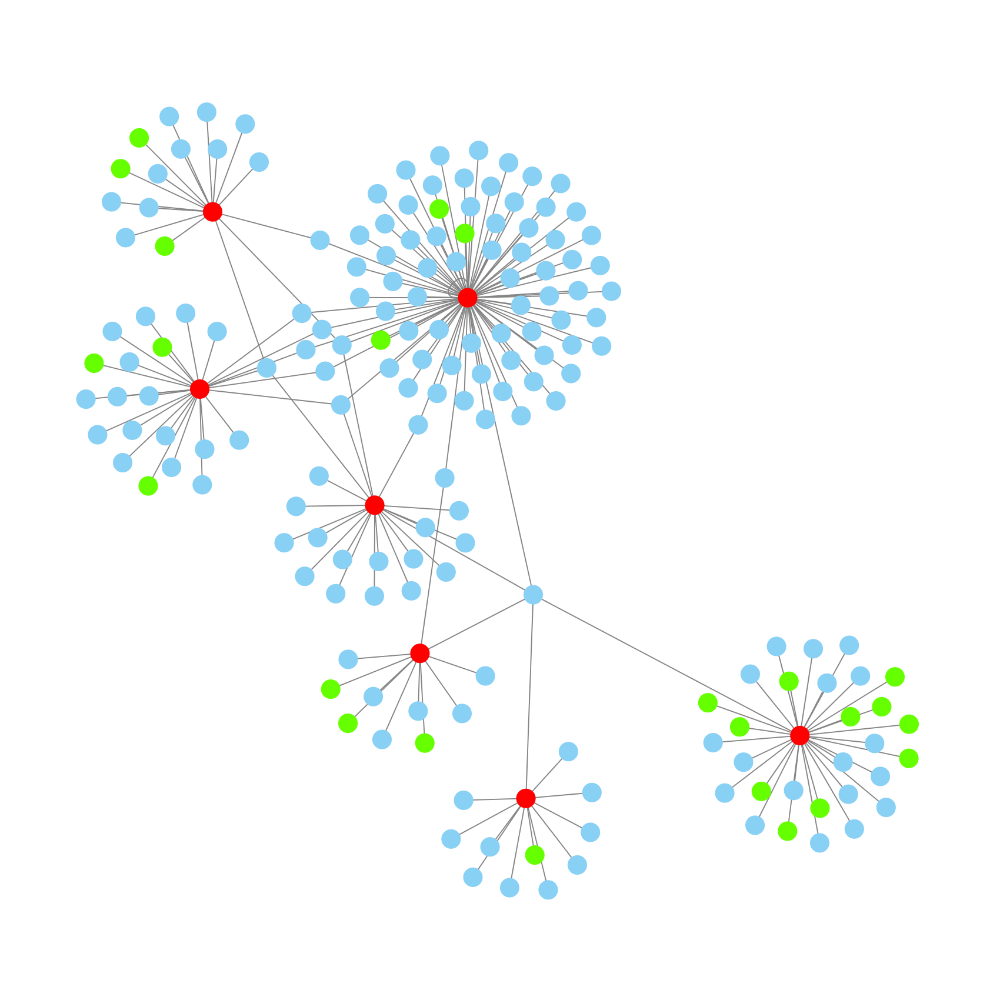

# SocMap

*The Social Mapping Framework*

## Overview

SocMap draws maps of communities on Twitter, starting from seed users you specify, then expanding to anyone they mention or retweet, then anyone *they* mention and retweet, ...

The results can be viewed in graphing software like [Gephi](https://gephi.org/) or [Cytoscape](http://cytoscape.org) to produce graphs like the following:

See [map examples](https://socmap.daylightingsociety.org/datasets) for more.

## Documentation

Run `./socmap.py --help` for usage, or [see the full web documentation](https://socmap.daylightingsociety.org/documentation) for more details.
